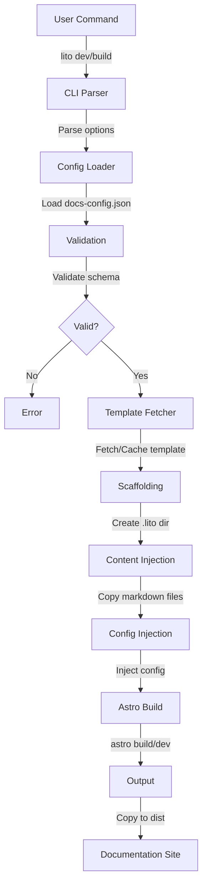

# Architecture

Lito is a command-line tool that simplifies creating beautiful documentation sites. It acts as a wrapper around [Astro](https://astro.build), abstracting away boilerplate configuration for Astro projects, MDX integration, Tailwind CSS, and other dependencies, while providing a clean, simple configuration surface.

## System Architecture

## The Build Process

When you run a command like `lito build -i ./docs -o ./dist`, the following sequence occurs:

1. **Command Parsing**: The CLI parses your command and options using Commander.js
2. **Validation**: Your `docs-config.json` is validated against a Zod schema
3. **Template Resolution**: Lito resolves the template (default, GitHub URL, or local path)
4. **Scaffolding**: A temporary `.lito` directory is created containing:
   - Core Astro configuration
   - Layout components
   - UI components
   - Style definitions
5. **Content Injection**: Your markdown/MDX files are copied to `.lito/src/content/docs`
6. **Config Injection**: Your configuration is parsed and injected into the build context
7. **Astro Build**: The CLI runs `astro build` inside the temporary directory
8. **Output Generation**: Static files are optimized and copied to your output directory (default: `dist`)
9. **Cleanup**: Temporary files are cleaned up after build completion

## Why Astro?

We chose Astro for Lito because:

- **Content Collections API**: Perfect for managing and organizing documentation pages with built-in validation
- **Islands Architecture**: Enables selective hydration of interactive components (search, tabs, etc.) while keeping most of the page as static HTML
- **Zero-JS by Default**: Astro generates minimal JavaScript, ensuring blazing-fast load times and exceptional performance
- **MDX Support**: Native support for mixing Markdown with React components
- **Static Generation**: Creates truly static sites that can be deployed anywhere with minimal overhead
