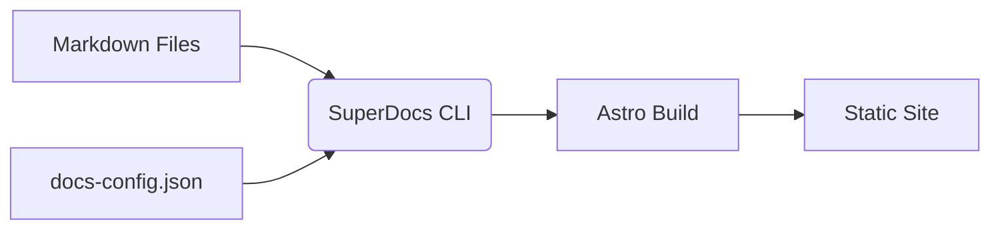

# What is SuperDocs?

SuperDocs is a modern static site generator specifically designed for documentation. It bridges the gap between simple zero-config tools and full-fledged frameworks like Astro or Next.js.

## The Problem

Building a documentation site usually involves a trade-off:
- **Option A**: Use a hosted platform (easy, but expensive and locked-in).
- **Option B**: Use a general-purpose framework (flexible, but high setup effort).
- **Option C**: Use a simple markdown-to-html tool (easy, but ugly and limited).

## The Solution

SuperDocs provides:

1.  **The "Mintlify" Experience**: Defined via a simple config file.
2.  **The "Astro" Power**: Under the hood, it's just an Astro build. You can "eject" or simply add Astro components to your pages.
3.  **Self-Hosted Freedom**: Output static HTML/CSS/JS that you can host anywhere (Vercel, Netlify, GitHub Pages, S3).

## How it works

1.  You provide a folder of Markdown/MDX files.
2.  You provide a `docs-config.json` for global settings (navigation, branding).
3.  SuperDocs CLI compiles this into a full Astro project and builds it.

## Comparisons

| Feature | SuperDocs | Docusaurus | Mintlify |
| :--- | :--- | :--- | :--- |
| **Setup Time** | < 1 min | 15 mins | < 1 min |
| **Cost** | Free | Free | $$$ |
| **Customization** | High (MDX + Astro) | High (React) | Medium |
| **Engine** | Astro | React | Closed source |

## Ready to dive in?

Check out the [Installation](/getting-started/installation) guide to get started.
